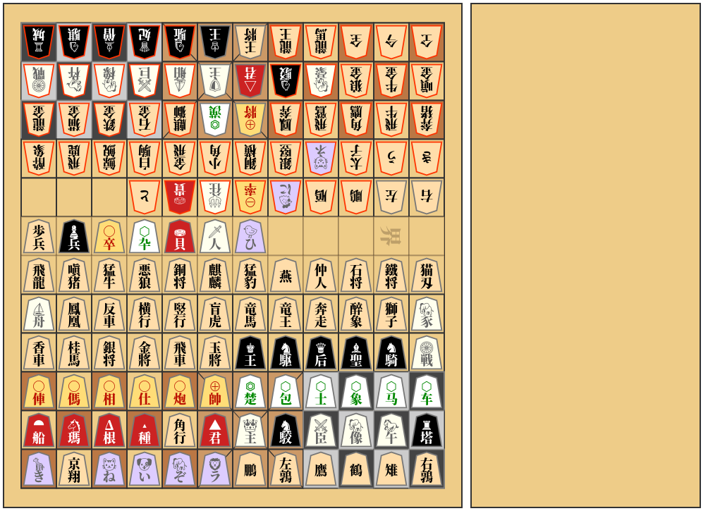

# ShogiCross(将棋クロス)
　  
様々な将棋類を将棋駒として実体化するプロジェクト。

## [収録ゲーム](http://shogicross.yosgspec.complayBoard.html)
* 将棋
* チェス
* シャンチー
* チャンギ
* マークルック
* チャトランガ
* どうぶつしょうぎ
* 禽将棋
* 中将棋
* Grand Acedrex
* クーリエチェス
* その他バリエーション等

### [駒情報](doc/pieces/README.md)
実装済の駒の定義一覧。

## Webアプリ
様々な将棋類の駒を並べるだけの将棋盤のようなツール

### 実装
* [ShogiCross App](http://shogicross.yosgspec.com)
* [単品ゲーム集](http://shogicross.yosgspec.com/dist)
* [将棋類紹介](http://shogicross.yosgspec.com/playBoard.html)
* [将棋駒Viewer](http://shogicross.yosgspec.com/pieceViewer.html)

### ライブラリ
任意のページへ設置。駒やボードの追加も対応。
* [ドキュメント](http://shogicross.yosgspec.com/doc)
* [ダウンロード](http://shogicross.yosgspec.com/doc/#getStarted)

### 特徴
* 様々な将棋類の表示に対応
* 4人用ボード対応
* 手を戻す、進める機能
* 盤面回転機能(棋譜とは同期しない)
* 画像出力機能
* BOD形式での局面入出力機能(独自拡張あり)
* レスポンシブ対応
* オリジナルの駒配置を設定 (チェス対将棋も容易)
* 画像を用意せずに追加駒を設定
* 視覚的にわかりやすい駒データ定義
* Webページに簡単設置([CodePen](https://codepen.io/yosgspec/pen/bGJqNJr))

  * <details>
	<summary>サンプルコード</summary>

	```html
	<canvas id="shogi"></canvas>
	<script src="https://cdn.jsdelivr.net/gh/yosgspec/ShogiCross@main/src/dist/ShogiCross.iife.min.js"></script>
	<script>
	var shogi = ShogiCross.Board.run(
		document.getElementById("shogi"),
		ShogiCross.gameSoft.shogi);
	</script>
	```
	</details>

## [ペーパークラフト](paper/README.md)
様々な将棋類を紙の力で実体化。

## [ディレクトリ構成](doc/root/README.md)
プロジェクトのディレクトリ構成。

## 使用フォント
下記のフォントを採用(優先度順)。
* [Noto Serif JP Black](https://fonts.google.com/noto/specimen/Noto+Serif+JP)
* [Noto Emoji](https://fonts.google.com/noto/specimen/Noto+Emoji?noto.query=emoji)
* [Noto Sans Symbols 2](https://fonts.google.com/noto/specimen/Noto+Sans+Symbols+2?noto.query=Symbols)
* [Noto Sans Symbols](https://fonts.google.com/noto/specimen/Noto+Sans+Symbols?noto.query=Symbols)
* [Noto Serif Black](https://fonts.google.com/noto/specimen/Noto+Serif?noto.query=serif)
* [Noto Serif TC Black](https://fonts.google.com/noto/specimen/Noto+Serif+TC?noto.query=serif+tc)

本来は楷書体が適切だと考えるが文字の網羅性と扱いやすさからNotoフォントで統一。

## 使用ライブラリ
Webアプリの本体についてはVanilla.jsで実装。

ビルドツールとして下記を採用。いずれも最適化のためのもので必須ではない。

|ライブラリ|用途
|:---------|:----
|[npm-run-all](https://github.com/mysticatea/npm-run-all)|npmビルド処理直列化
|[Vite](https://ja.vitejs.dev)|コード1ファイル化
|[Toptal Minifier Tool](https://www.toptal.com/developers/javascript-minifier)|コード最小化
|[TypeScript](https://www.typescriptlang.org/ja/)|型定義ファイル(.d.ts)生成
|[ADM-ZIP](https://github.com/cthackers/adm-zip/wiki/ADM-ZIP)|ZIPファイル生成
|[sharp-cli](https://github.com/vseventer/sharp-cli)|画像ファイル最適化
|[documentation.js](https://github.com/documentationjs/documentation)|JSDocドキュメント生成
|[jsDelivr](https://www.jsdelivr.com/github)|CDNリンクの取得

## [ライセンス](LICENSE)
CC0-1.0。コードの引用再利用ご自由に。

## その他
その他不足情報があれば、下記を参照。  
(過去類似作成物)
* [超棋.pdf](doc/超棋.pdf)
