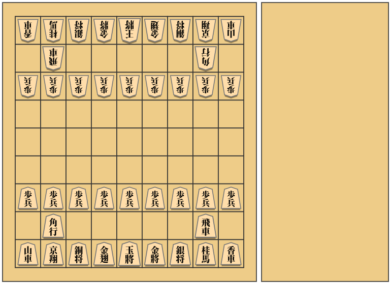
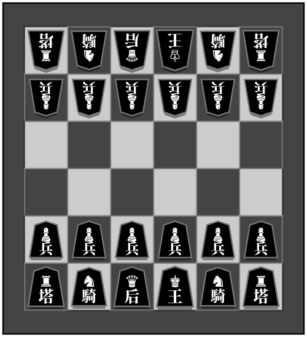
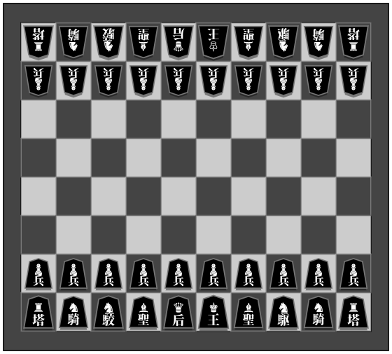
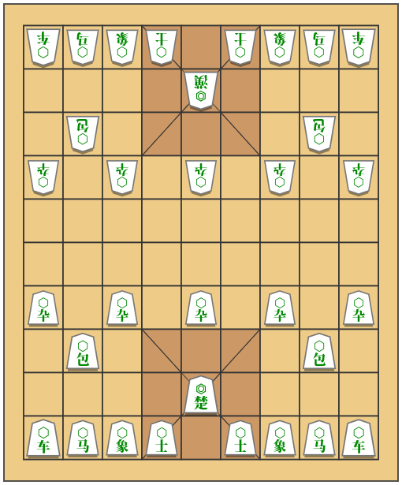
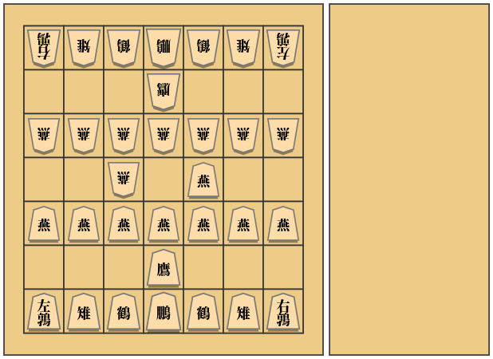

# 駒配置表 - ShogiCross
## [将棋](https://ja.wikipedia.org/wiki/%E5%B0%86%E6%A3%8B)
一般的な将棋。本将棋とも呼ばれる。持ち駒あり。  

バリエーション

### [5五将棋](https://ja.wikipedia.org/wiki/5%E4%BA%94%E5%B0%86%E6%A3%8B)
簡略化された将棋。持ち駒あり。  

### [朝倉象棋](https://ja.wikipedia.org/wiki/%E5%B0%8F%E5%B0%86%E6%A3%8B#%E6%9C%9D%E5%80%89%E8%B1%A1%E6%A3%8B)
持ち駒が使用できる小将棋。持ち駒あり。  

### [京将棋](https://ja.wikipedia.org/wiki/%E4%BA%AC%E5%B0%86%E6%A3%8B)
京翔と銅将を追加した将棋。左右の配置が存在。持ち駒あり。  
  

### [小将棋](https://ja.wikipedia.org/wiki/%E5%B0%8F%E5%B0%86%E6%A3%8B)
中将棋から駒を取り入れて原点回帰した平安将棋。持ち駒なし。  

### [平安将棋](https://ja.wikipedia.org/wiki/%E5%B9%B3%E5%AE%89%E5%B0%86%E6%A3%8B)
記録が残る最古の日本の将棋。盤の大きさに緒説ある。持ち駒なし。  
  
  

### [小京将棋](https://ja.wikipedia.org/wiki/%E4%BA%AC%E5%B0%86%E6%A3%8B)
桂馬を京翔へ置き換えた本将棋。左右の配置が存在。持ち駒あり。  
  

### [山車将棋](https://ja.wikipedia.org/wiki/%E4%BA%AC%E5%B0%86%E6%A3%8B)
香車を山車へ置き換えた本将棋。左右の配置が存在。持ち駒あり。  
  

### [銅将棋](https://ja.wikipedia.org/wiki/%E4%BA%AC%E5%B0%86%E6%A3%8B)
銀将を銅将へ置き換えた本将棋。左右の配置が存在。持ち駒あり。  
  

### [金翅将棋](https://ja.wikipedia.org/wiki/%E4%BA%AC%E5%B0%86%E6%A3%8B)
金将を金翅へ置き換えた本将棋。左右の配置が存在。持ち駒あり。  
  

### [金斗将棋](https://ja.wikipedia.org/wiki/%E4%BA%AC%E5%B0%86%E6%A3%8B)
金将を金斗へ置き換えた本将棋。左右の配置が存在。持ち駒あり。  
  

### [将棋30++](https://ja.wikipedia.org/wiki/%E4%BA%AC%E5%B0%86%E6%A3%8B)
京将棋系の駒で複数置換した本将棋。左右の配置が存在。持ち駒あり。  
  

### [御妃将棋](https://en.wikipedia.org/wiki/Okisaki_shogi)
チェスの要素を取り入れた本将棋。香車はわざと反車として表示した。持ち駒あり。  

### [四人将棋](https://ja.wikipedia.org/wiki/%E5%9B%9B%E4%BA%BA%E5%B0%86%E6%A3%8B)
4人用の将棋。持ち駒あり。  

### [四神将棋](https://ja.wikipedia.org/wiki/%E5%9B%9B%E7%A5%9E%E5%B0%86%E6%A3%8B)
テレビ用の企画として考案された4人用の将棋。持ち駒あり。  

## [チェス](https://ja.wikipedia.org/wiki/%E3%83%81%E3%82%A7%E3%82%B9)
西洋の将棋類。西洋将棋とも呼ばれる。持ち駒なし。  

バリエーション

### [クレージーハウス](https://ja.wikipedia.org/wiki/%E3%82%AF%E3%83%AC%E3%83%BC%E3%82%B8%E3%83%BC%E3%83%8F%E3%82%A6%E3%82%B9)
持ち駒が使用できるチェス。持ち駒あり。  

### [ロスアラモスチェス](https://en.wikipedia.org/wiki/Los_Alamos_chess)
簡略化されたチェス。持ち駒なし。  

### [カパブランカチェス](https://en.wikipedia.org/wiki/Capablanca_chess)
マーシャル(エンプレス)、カーディナル(プリンセス)を追加したチェス。持ち駒なし。

### [グランドチェス](https://en.wikipedia.org/wiki/Grand_Chess)
カパブランカチェスと同様の駒を使用するが配置が異なる。持ち駒なし。  

### [4人チェス](https://en.wikipedia.org/wiki/Four-player_chess)
4人用のチェス。持ち駒なし。  

## [シャンチー](https://ja.wikipedia.org/wiki/%E3%82%B7%E3%83%A3%E3%83%B3%E3%83%81%E3%83%BC)
中国の将棋類。象棋、中国将棋とも呼ばれる。持ち駒なし。  

## [チャンギ](https://ja.wikipedia.org/wiki/%E3%83%81%E3%83%A3%E3%83%B3%E3%82%AE)
朝鮮半島の将棋類。朝鮮将棋とも呼ばれる。持ち駒なし。  

## [マークルック](https://ja.wikipedia.org/wiki/%E3%83%9E%E3%83%BC%E3%82%AF%E3%83%AB%E3%83%83%E3%82%AF)
タイの将棋類。タイ将棋とも呼ばれる。持ち駒なし。  

## [チャトランガ](https://ja.wikipedia.org/wiki/%E3%83%81%E3%83%A3%E3%83%88%E3%83%A9%E3%83%B3%E3%82%AC)
原初の将棋類。詳細なルールは失われている。持ち駒なし。  

バリエーション

### [チャトラジ](https://ja.wikipedia.org/wiki/%E3%83%81%E3%83%A3%E3%83%88%E3%83%A9%E3%82%B8)
四人用のバリエーション。本来はダイスで動かす駒を決める。持ち駒なし。  

### [どうぶつしょうぎ](https://www.silverstar.co.jp/02products/dobutsushogi/switch/animal.html)
入門用として考案された将棋。持ち駒あり。  

バリエーション

### [ごろごろどうぶつしょうぎ](https://www.silverstar.co.jp/02products/dobutsushogi/switch/gorogoro.html)
「きりん」と「ぞう」の代わりに「いぬ」(金将)と「ねこ」(銀将)を追加したどうぶつしょうぎ。5656将棋のどうぶつしょうぎ版。持ち駒あり。  

## [禽将棋](https://ja.wikipedia.org/wiki/%E7%A6%BD%E5%B0%86%E6%A3%8B)
鳥の名の駒を使用する将棋。特殊な動きをする駒が多い。持ち駒あり。  

## [中将棋](https://ja.wikipedia.org/wiki/%E4%B8%AD%E5%B0%86%E6%A3%8B)
現在でもプレイされることのある古将棋の一種。持ち駒なし。  

バリエーション

### [大将棋](https://ja.wikipedia.org/wiki/%E5%A4%A7%E5%B0%86%E6%A3%8B)
中将棋の祖先とされる古将棋。持ち駒なし。  

### [獅子将棋](https://drive.google.com/file/d/1emrOmE1Xh-sR8wApTOikEgXDGVaAYrrO/view)
中将棋を遊びやすくするよう考案された将棋。持ち駒なし。  

### [平成将棋](http://akasaka0x16.blog.fc2.com/blog-entry-130.html)
中将棋を遊びやすくするよう考案された将棋。持ち駒なし。  

## [和将棋](https://ja.wikipedia.org/wiki/%E5%92%8C%E5%B0%86%E6%A3%8B)
全ての駒に動物の名前を使用した古将棋の一種。持ち駒なし。  

## [Grant Acedrex](https://www.chessvariants.org/rules/grantacedrex)
古のチェスの一種。特殊な動きをする駒が多い。プロモーション先は本来は敵陣の到着列の駒となる(未実装)。持ち駒なし。  

## [クーリエチェス(定形配置)](https://en.wikipedia.org/wiki/Courier_chess)
古のチェスの一種。ビショップに等しい走り駒(クーリエ)が初めて使用された。持ち駒なし。  

バリエーション

## [クーリエチェス(初期配置)](https://en.wikipedia.org/wiki/Courier_chess)
クーリエチェスの定形移動を行わない配置。持ち駒なし。  

