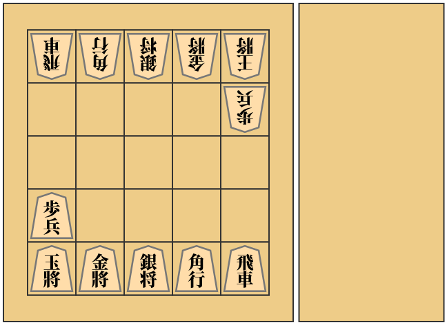
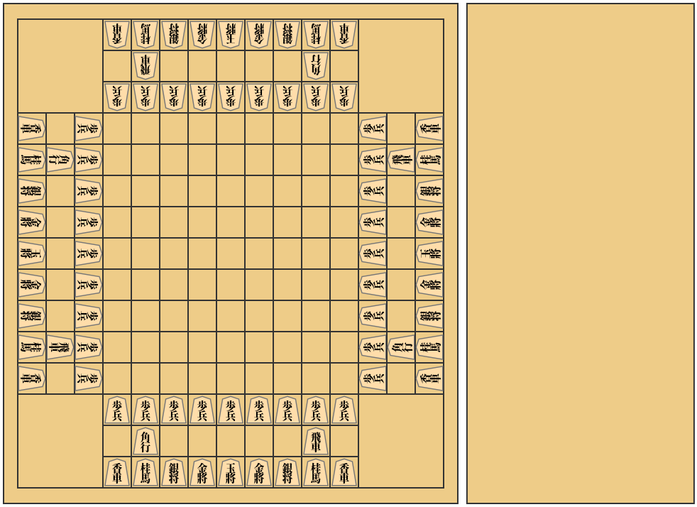
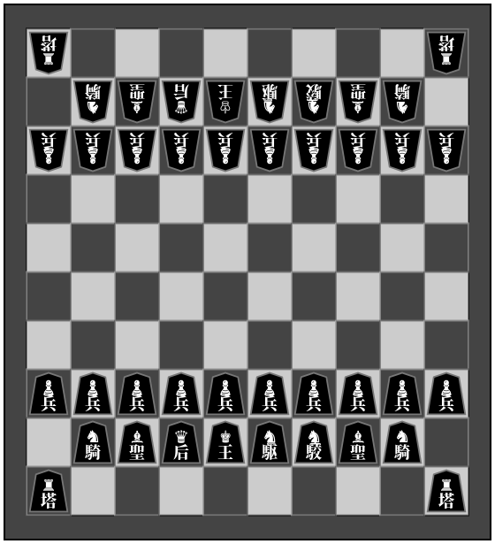
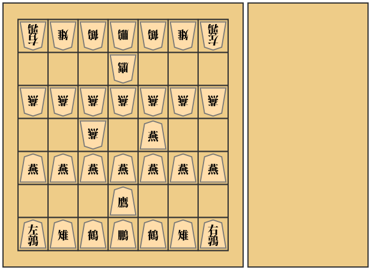
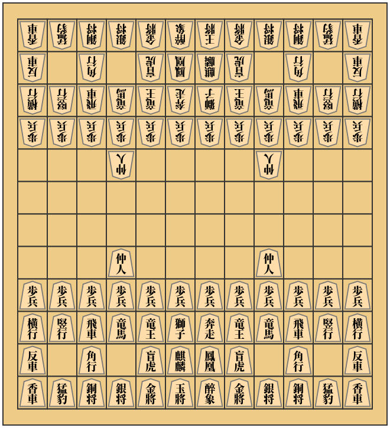
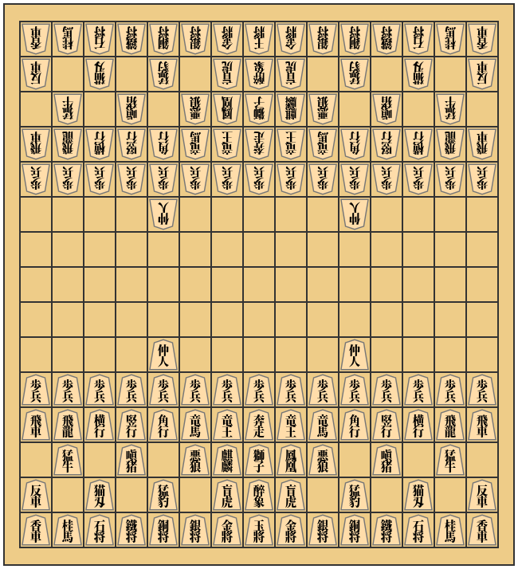

# 駒配置表
## [将棋](https://ja.wikipedia.org/wiki/%E5%B0%86%E6%A3%8B)
一般的な将棋。本将棋とも呼ばれる。持ち駒あり。  

バリエーション

### [5五将棋](https://ja.wikipedia.org/wiki/5%E4%BA%94%E5%B0%86%E6%A3%8B)
簡略化された将棋。持ち駒あり。  

### [朝倉象棋](https://ja.wikipedia.org/wiki/%E5%B0%8F%E5%B0%86%E6%A3%8B#%E6%9C%9D%E5%80%89%E8%B1%A1%E6%A3%8B)
持ち駒が使用できる小将棋。持ち駒あり。  

### [京将棋](https://ja.wikipedia.org/wiki/%E4%BA%AC%E5%B0%86%E6%A3%8B)
京翔と銅将を追加した将棋。持ち駒あり。  

### [四人将棋](https://ja.wikipedia.org/wiki/%E5%9B%9B%E4%BA%BA%E5%B0%86%E6%A3%8B)
4人用の将棋。持ち駒あり。  

### [四神将棋](https://ja.wikipedia.org/wiki/%E5%9B%9B%E7%A5%9E%E5%B0%86%E6%A3%8B)
テレビ用の企画として考案された4人用の将棋。持ち駒あり。  

## [チェス](https://ja.wikipedia.org/wiki/%E3%83%81%E3%82%A7%E3%82%B9)
西洋の将棋類。持ち駒なし。  

バリエーション

### [ロスアラモスチェス](https://en.wikipedia.org/wiki/Los_Alamos_chess)
簡略化された将棋。持ち駒なし。  

### [カパブランカチェス](https://en.wikipedia.org/wiki/Capablanca_chess)
マーシャル(エンプレス)、カーディナル(プリンセス)を追加したチェス。持ち駒なし。

### [グランドチェス](https://en.wikipedia.org/wiki/Grand_Chess)
カパブランカチェスと同様の駒を使用するが配置が異なる。持ち駒なし。  

### [4人チェス](https://en.wikipedia.org/wiki/Four-player_chess)
4人用のチェス。持ち駒なし。  

## [シャンチー](https://ja.wikipedia.org/wiki/%E3%82%B7%E3%83%A3%E3%83%B3%E3%83%81%E3%83%BC)
中国の将棋類。持ち駒なし。  

## [チャンギ](https://ja.wikipedia.org/wiki/%E3%83%81%E3%83%A3%E3%83%B3%E3%82%AE)
朝鮮半島の将棋類。持ち駒なし。  

## [マークルック](https://ja.wikipedia.org/wiki/%E3%83%9E%E3%83%BC%E3%82%AF%E3%83%AB%E3%83%83%E3%82%AF)
タイの将棋類。持ち駒なし。  

## [チャトランガ](https://ja.wikipedia.org/wiki/%E3%83%81%E3%83%A3%E3%83%88%E3%83%A9%E3%83%B3%E3%82%AC)
原初の将棋類。詳細なルールは失われている。持ち駒なし。  

バリエーション

### [チャトラジ](https://ja.wikipedia.org/wiki/%E3%83%81%E3%83%A3%E3%83%88%E3%83%A9%E3%82%B8)
四人用のバリエーション。持ち駒なし。  

### [どうぶつしょうぎ](https://www.silverstar.co.jp/02products/dobutsushogi/switch/animal.html)
入門用として考案された将棋。持ち駒あり。  

バリエーション

### [ごろごろどうぶつしょうぎ](https://www.silverstar.co.jp/02products/dobutsushogi/switch/gorogoro.html)
「きりん」と「ぞう」の代わりに「いぬ」(金将)と「ねこ」(銀将)を追加したどうぶつしょうぎ。持ち駒あり。  

## [禽将棋](https://ja.wikipedia.org/wiki/%E7%A6%BD%E5%B0%86%E6%A3%8B)
鳥の名の駒を使用する将棋。持ち駒あり。  

## [中将棋](https://ja.wikipedia.org/wiki/%E4%B8%AD%E5%B0%86%E6%A3%8B)
現在でもプレイされることのある古将棋の一種。持ち駒なし。  

バリエーション

### [大将棋](https://ja.wikipedia.org/wiki/%E5%A4%A7%E5%B0%86%E6%A3%8B)
中将棋の祖先とされる古将棋。持ち駒なし。  

### [獅子将棋](https://drive.google.com/file/d/1emrOmE1Xh-sR8wApTOikEgXDGVaAYrrO/view)
中将棋を遊びやすくするよう考案された将棋類。持ち駒なし。  

