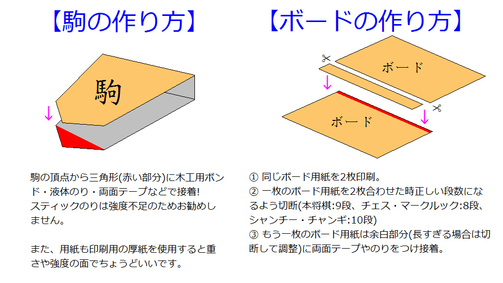

# 将棋クロス【CrossShogi】
  
様々な将棋類を将棋駒として実体化するプロジェクト。

## Webアプリ
http://tool.yosgspec.com/shogiCross/  
駒を自由に並べ替えたりできるやつ。  
CPUやゲームルールは実装されていません。

## 駒配置
[別紙を参照](/docs/positions/README.md)

## ペーパークラフト
### コンポーネントの組み立て

### コンポーネント一覧
[ファイルはこちらを参照。](dist)

#### 駒
##### [paperPiece.pdf](/paper/distpaperPiece.pdf)
1ゲームあたり2部必要。  
必要な駒が含まれるページのみ印刷のこと。

#### ボード
##### [board_〇〇.pdf](#コンポーネント構成早見表)
必要なボードのみ印刷する。  
`board_any`とつくファイルについては特定のゲームによらず使用できるよう想定。  
不要なマスについては紙などを当てて隠すこと。

#### 駒箱
##### [toolBox.pdf](/paper/disttoolBox.pdf)
必要な箱のページのみ印刷する。  
2ページで1組になる。  

#### ???
##### [pack.pdf](/paper/distpack.pdf)
なにかの妄想の産物。  
ロゴ画像も含むため、貼り付けたい場合など印刷する。

#### コンポーネント構成早見表

|ゲーム                  |[駒ページ](/paper/distpaperPiece.pdf)| ボード
|:-----------------------|:---------|:--------------------
|**将棋**                |1         |[board_shogi.pdf](/paper/dist/board_shogi.pdf)
|5五将棋                 |1         |[board_shogi5x5.pdf](/paper/distboard_shogi5x5.pdf)
|朝倉象棋                |1         |[board_shogi.pdf](/paper/distboard_shogi.pdf)
|京将棋                  |1         |[board_shogi10x10.pdf](/paper/distboard_shogi10x10.pdf)
|四人将棋                |1         |[board_shogi.pdf](/paper/distboard_shogi.pdf)
|四神将棋                |1         |[board_some15x15.pdf](/paper/distboard_some15x15.pdf)
|**チェス**              |2         |[board_chess.pdf](/paper/distboard_chess.pdf)
|ロスアラモスチェス      |2         |[board_chess6x6.pdf](/paper/distboard_chess6x6.pdf)
|カパブランカチェス      |2         |[board_chess10x8.pdf](/paper/distboard_chess10x8.pdf)
|グランドチェス          |2         |[board_chess10x10.pdf](/paper/distboard_chess10x10.pdf)
|4人チェス               |2         |[board_some15x15.pdf](/paper/distboard_some15x15.pdf)
|**シャンチー**          |3         |[board_xiangqi.pdf](/paper/distboard_xiangqi.pdf)
|**チャンギ**            |4         |[board_janngi.pdf](/paper/distboard_janngi.pdf)
|**マークルック**        |5         |[board_makruk.pdf](/paper/distboard_makruk.pdf)
|**チャトランガ**        |6         |[board_chess.pdf](/paper/distboard_chess.pdf)
|チャトラジ              |6         |[board_chess.pdf](/paper/distboard_chess.pdf)
|**どうぶつしょうぎ**    |5         |[board_dobutsu.pdf](/paper/distboard_dobutsu.pdf)
|ごろごろどうぶつしょうぎ|5         |[board_dobutsu5x6.pdf](/paper/distboard_dobutsu5x6.pdf)
|**禽将棋**              |6         |[board_shogi7x7.pdf](/paper/distboard_shogi7x7.pdf)
|**中将棋**              |1,7       |[board_shogi12x12.pdf](/paper/distboard_shogi12x12.pdf)
|大将棋                  |1,3,4,7,8 |[board_shogi15x15.pdf](/paper/distboard_shogi15x15.pdf)
|獅子将棋                |1,7       |[board_shogi.pdf](/paper/distboard_shogi.pdf)

### おすすめ商品
印刷や組み立てに使用材料としておすすめする商品など。

#### 大箱
##### [ダイソー ストックBOX](https://jp.daisonet.com/collections/storage/products/4549131121650)
駒箱・ボード等全てのコンポーネントを格納する箱。  
駒箱が綺麗に12箱収まる。  
ボードについては4つ折りとして収納。

#### 駒・駒箱
##### [コクヨ 厚紙用紙 A4](https://www.amazon.co.jp/dp/B00009AJBN)
##### [キョクトウ ぶ厚いコピー用紙 A4](https://www.amazon.co.jp/dp/B00HLA4HFQ)
厚手のコピー用紙を使用。  
コクヨの方が低コストで購入可能。
キョクトウの方が厚くなるため、強度が更に必要と感じる場合はこれを使用。

##### [セメダイン 木工用速乾](https://www.yodobashi.com/product/100000001003425270/)*
紙用接着剤として木工用ボンドを使用。  
メーカーはこだわる必要ないが、速乾の方が扱いやすい。

#### ボード
##### [BBEST 厚手マット合成紙 A4](https://www.amazon.co.jp/gp/product/B0BPMCM41B/)
半プラスチックな用紙で強度に優れる。  
木工用ボンドでの接着ができないため工作性がやや劣る。  
(瞬間接着剤を使っても良いかも?)

##### [スリーエム 超強力接着剤](https://www.amazon.co.jp/gp/product/B016NNBJG6/)
汎用の接着剤。乾燥に時間がかかるため、接着後何時間も放置が必要になる。

#### ???
##### [ミツワ 強力防臭におわないチャック袋](https://www.amazon.co.jp/gp/product/B09L7RLSVQ)
TCGのパックもどきをやるのに使用。  
ラベルシールを貼ってそれっぽくする。

##### [BBEST ラベル用紙 A4](https://www.amazon.co.jp/gp/product/B09BZ91LY3)
ラベルシール。大箱をこれでデコっても良い。

## その他
その他不足情報があれば、下記を参照
* [超棋](docs/超棋.pdf)