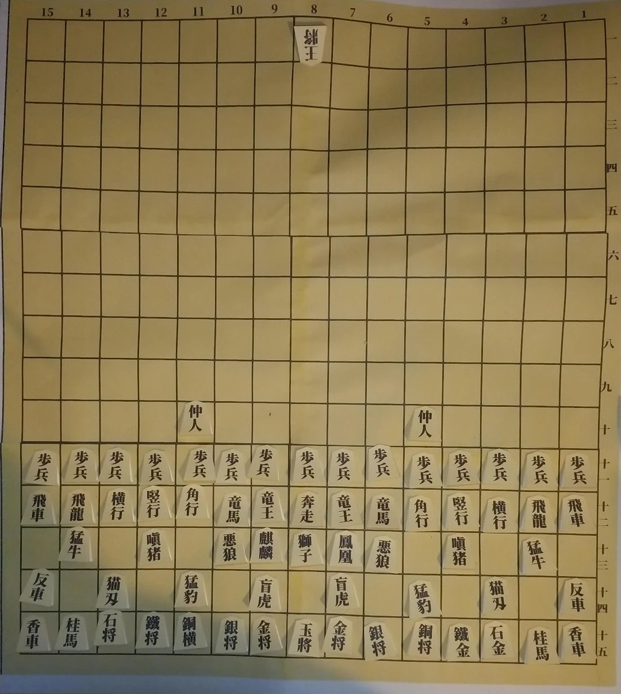

# ペーパークラフト - ShogiCross
様々な将棋類を紙の力で実体化。  
必要なものの印刷を行い組み立てる。

## 駒配置
[別紙を参照。](../doc/positions/README.md)

## 駒情報
[別紙を参照。](../doc/pieces/README.md)

## コンポーネントの組み立て

## コンポーネント一覧
[ファイルはこちらを参照。](dist/)

### 駒
#### [paperPiece.pdf](dist/paperPiece.pdf)
1ゲームあたり2部必要。  
必要な駒が含まれるページのみ印刷のこと。

### ボード
#### [board_〇〇.pdf](#コンポーネント構成早見表)
必要なボードのみ印刷する。  
`board_any`とつくファイルについては特定のゲームによらず使用できるよう想定。  
不要なマスについては折り込むか紙などを当てて隠すこと。

### 駒箱
#### [toolBox_〇〇.pdf](#コンポーネント構成早見表)
必要な箱のみ印刷する。  
`toolBox_option`と`toolBox_setting`は部品・予備等の汎用として使用する。  
2ページで1組になる。

### アクセサリ
#### [pack.pdf](dist/pack.pdf)
ロゴ画像、QRコードと謎のパック画像のセット。  
装飾として貼り付ける場合に印刷する。

### コンポーネント構成早見表

|ゲーム                  |[駒ページ](dist/paperPiece.pdf)| ボード | 駒箱
|:-----------------------|:---------|:--------------------------------------------------|:----
|**将棋**                |1         |[board_shogi.pdf](dist/board_shogi.pdf)            |[toolBox_shogi.pdf](dist/toolBox_shogi.pdf)
|5五将棋                 |1         |[board_shogi5x5.pdf](dist/board_shogi5x5.pdf)      |―
|朝倉象棋                |1         |[board_shogi.pdf](dist/board_shogi.pdf)            |―
|京将棋                  |1         |[board_shogi10x10.pdf](dist/board_shogi10x10.pdf)  |―
|四人将棋                |1         |[board_shogi.pdf](dist/board_shogi.pdf)            |―
|四神将棋                |1         |[board_4shogi15x15.pdf](dist/board_4shogi15x15.pdf)|―
|**チェス**              |2         |[board_chess.pdf](dist/board_chess.pdf)            |[toolBox_chess.pdf](dist/toolBox_chess.pdf)
|クレージーハウス        |2         |[board_chess.pdf](dist/board_chess.pdf)            |―
|ロスアラモスチェス      |2         |[board_chess6x6.pdf](dist/board_chess6x6.pdf)      |―
|カパブランカチェス      |2         |[board_chess10x8.pdf](dist/board_chess10x8.pdf)    |―
|グランドチェス          |2         |[board_chess10x10.pdf](dist/board_chess10x10.pdf)  |―
|4人チェス               |2         |[board_4chess14x14.pdf](dist/board_4chess14x14.pdf)|―
|**シャンチー**          |3         |[board_xiangqi.pdf](dist/board_xiangqi.pdf)        |[toolBox_xiangqi.pdf](dist/toolBox_xiangqi.pdf)
|**チャンギ**            |4         |[board_janngi.pdf](dist/board_janngi.pdf)          |[toolBox_janngi.pdf](dist/toolBox_janngi.pdf)
|**マークルック**        |5         |[board_makruk.pdf](dist/board_makruk.pdf)          |[toolBox_makruk.pdf](dist/toolBox_makruk.pdf)
|**チャトランガ**        |6         |[board_chess.pdf](dist/board_chess.pdf)            |[toolBox_chaturanga.pdf](dist/toolBox_chaturanga.pdf)
|チャトラジ              |6         |[board_chess.pdf](dist/board_chess.pdf)            |―
|**どうぶつしょうぎ**    |5         |[board_dobutsu.pdf](dist/board_dobutsu.pdf)        |[toolBox_dobutsuShogi.pdf](dist/toolBox_dobutsuShogi.pdf)
|ごろごろどうぶつしょうぎ|5         |[board_dobutsu5x6.pdf](dist/board_dobutsu5x6.pdf)  |―
|**禽将棋**              |6         |[board_shogi7x7.pdf](dist/board_shogi7x7.pdf)      |[toolBox_toriShogi.pdf](dist/toolBox_toriShogi.pdf)
|**中将棋**              |1,7       |[board_shogi12x12.pdf](dist/board_shogi12x12.pdf)  |[toolBox_chuShogi.pdf](dist/toolBox_chuShogi.pdf)
|大将棋                  |1,3,4,7,8 |[board_shogi15x15.pdf](dist/board_shogi15x15.pdf)  |[toolBox_daiShogi.pdf](dist/toolBox_daiShogi.pdf)
|獅子将棋                |1,7       |[board_shogi.pdf](dist/board_shogi.pdf)            |―
|**和将棋**              |11        |[board_shogi11x11.pdf](dist/board_shogi11x11.pdf)  |[toolBox_waShogi.pdf](dist/toolBox_waShogi.pdf)
|**Grant Acedrex**       |9         |[board_chess12x12.pdf](dist/board_chess12x12.pdf)  |[toolBox_grantAcedrex.pdf](dist/toolBox_grantAcedrex.pdf)
|**クーリエチェス**      |10        |[board_chess12x12.pdf](dist/board_chess12x12.pdf)  |[toolBox_courierChess.pdf](dist/toolBox_courierChess.pdf)
|**汎用**                |―        |[board_any10x10.pdf](dist/board_any10x10.pdf) [board_any15x15.pdf](dist/board_any15x15.pdf)|[toolBox.pdf](dist/toolBox.pdf) [toolBox_option.pdf](dist/toolBox_option.pdf) [toolBox_setting.pdf](dist/toolBox_setting.pdf)

## おすすめ商品
印刷や組み立てに使用材料としておすすめする商品など。

### 大箱
#### [ダイソー ストックBOX](https://monosizecatalog.com/item-4549131121650/)
駒箱・ボード等全てのコンポーネントを格納する箱。  
駒箱が綺麗に12箱収まる。  
ボードについては4つ折りとして収納。  
(もしかしたらもう廃番かも...)

#### [BBEST ラベル用紙 A4](https://www.amazon.co.jp/gp/product/B09BZ91LY3)
ラベルシール。ロゴやQRコードで箱をこれでデコるのに使用。

### 駒・駒箱
#### [コクヨ 厚紙用紙 A4](https://www.amazon.co.jp/dp/B00009AJBN)
#### [キョクトウ ぶ厚いコピー用紙 A4](https://www.amazon.co.jp/dp/B00HLA4HFQ)
厚手のコピー用紙を使用。  
コクヨの方が低コストで購入可能。  
キョクトウの方が厚くなるため、強度が更に必要と感じる場合はこれを使用。

#### [セメダイン 木工用速乾](https://www.yodobashi.com/product/100000001003425270/)
紙用接着剤として木工用ボンドを使用。  
メーカーはこだわる必要ないが、速乾の方が扱いやすい。

### ボード
#### [BBEST 厚手マット合成紙 A4](https://www.amazon.co.jp/gp/product/B0BPMCM41B/)
半プラスチックな用紙で強度に優れる。  
木工用ボンドでの接着ができないため工作性がやや劣る。  
(瞬間接着剤を使っても良いかも?)

#### [LOCTITE(ロックタイト) 強力瞬間接着剤](https://www.amazon.co.jp/dp/B009CN6988)
汎用の瞬間接着剤。プラスチック系の材料ならこれで接着できるはず。  
未使用のため使用感の感想はなし。

#### [スリーエム 超強力接着剤](https://www.amazon.co.jp/gp/product/B016NNBJG6/)
汎用の接着剤。乾燥に時間がかかるため、接着後何時間も放置が必要になる。  
やや使いにくいので普通の瞬間接着剤でもいいかも...

### アクセサリ
#### [ミツワ 強力防臭におわないチャック袋](https://www.amazon.co.jp/gp/product/B09L7RLSVQ)
TCGのパックもどきをやるのに使用。  
ラベルシールを貼ってそれっぽくする。

## ペーパークラフト参考画像
### 大将棋
醉象を並べ忘れてる。  

